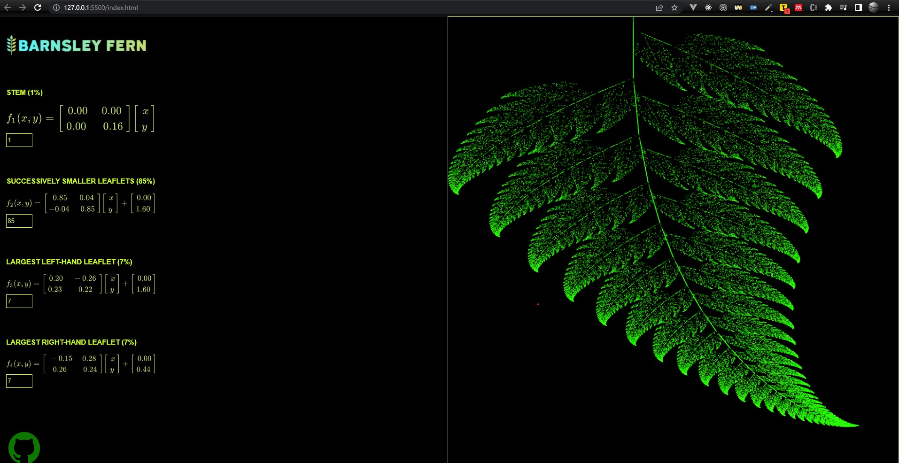

# 

# [Non Responsive Barnsley fern](https://github.com/danielm2402/barnsley-fern)
Drawing of the fractal "Barnsley fern" in html, allows you to configure the randomness and create other figures.
## [Try it yourself](https://github.com/danielm2402/barnsley-fern)

## Features
* [JavaScript]
* [HTML]

## Screenshots

